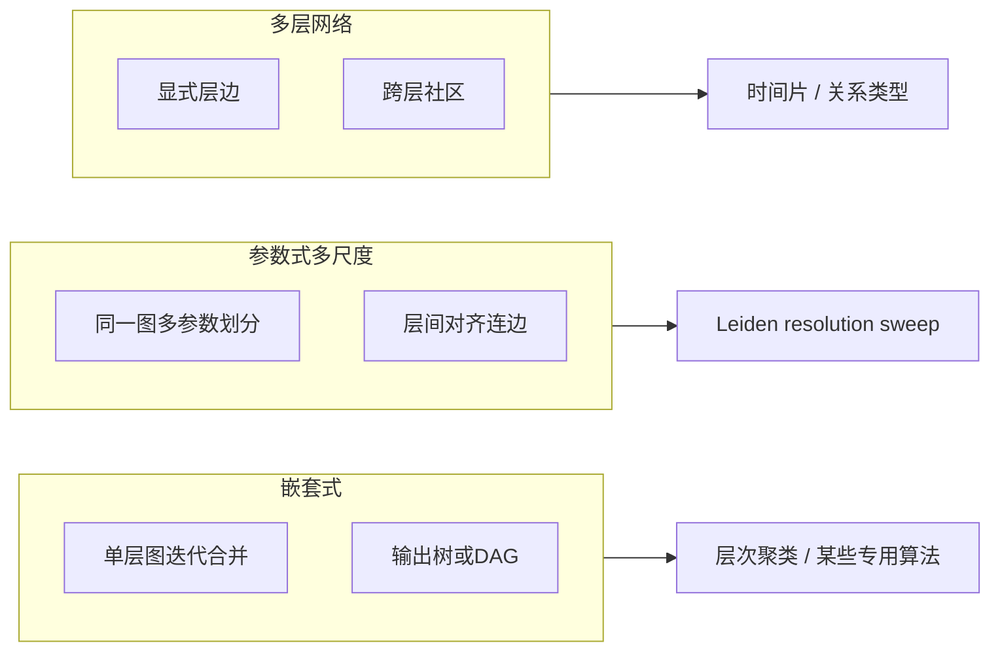

# 分层社区结构：常见做法与本项目对照

本文说明图社区「分层结构」在文献与工程里的常见范式，并对照本仓库中 **Leiden 多分辨率扫描 + 相邻层父子连边** 的实现方式与可视化入口。

## 1. 为什么需要「分层」

单层划分只给一张「扁平」标签。真实网络往往有多尺度：粗粒度大领域、细粒度子方向。分层回答的是：**不同粒度之间，社区如何对应、如何嵌套或演化**。

## 2. 常见范式（从「真树」到「伪层级」）



- **嵌套式（hierarchical / nested）**  
  在同一图上反复合并模块（如 Clauset–Newman–Moore 风格的层次结构，或 Louvain 的多轮），得到**一棵树**；每层是**对上一层块的再划分或合并**。优点是层级语义清晰；缺点是算法与图假设强绑定，不一定适合 embedding–KNN 图上的所有场景。

- **参数式多尺度（multiresolution，你项目的主线）**  
  **固定一张图**（如 mutual-kNN），用 **resolution（或 CPM 的 γ）** 扫出一族划分；再在**相邻参数**的两层划分之间用 **列联表 / 重叠度** 建 **parent–child 边**，得到**多层标签上的 DAG 或森林近似**。这不是算法内建的「一棵树」，而是**事后对齐**出的层级可读结构；优点是灵活、和 Leiden 生态一致；缺点是层间边依赖对齐规则（例如每个子社区只连一个父社区时需理解其贪心含义）。

- **多层网络（multilayer / temporal）**  
  不同层是不同图或不同时间窗，社区发现可每层独立再做对齐（你仓库里 [`src/time_window.py`](../../src/time_window.py) 的 inherited/refit 属于这一类思路的变体）。

## 3. 本仓库里「分层」具体怎么做

数据流：**embedding → mutual-kNN → 多分辨率 Leiden → 相邻分辨率对齐**。

| 步骤 | 位置 | 作用 |
|------|------|------|
| 多分辨率划分 | [`src/community.py`](../../src/community.py) 中 `leiden_sweep` | 每个 `r` 一份 `membership` |
| 层间连边 | 同文件 `build_parent_child_links` + `build_hierarchy_from_sweep` | 相邻 `r` 的 parent/child 标签做列联；对每个 **child 社区**，取与其交集最大的 **一个** parent（见下方代码片段）；再按 `child_share` 阈值过滤边 |
| 诊断 | `detect_breakpoints`、`plot_sweep_diagnostics` | 社区数跳变、相邻 VI 等标「关键分辨率」 |
| 层级图可视化 | [`src/hierarchy_viz.py`](../../src/hierarchy_viz.py) | 读 `hierarchy_nodes.csv` / `hierarchy_edges.csv` 画图（README 有命令示例） |

层间对齐的核心逻辑（每个 child 只保留「交集最大」的 parent 一条主边）；完整实现见 [`src/community.py`](../../src/community.py) 中 `build_parent_child_links`：

```373:408:src/community.py
def build_parent_child_links(
    parent_labels: np.ndarray,
    child_labels: np.ndarray,
    *,
    r_parent: float,
    r_child: float,
) -> List[Dict[str, Any]]:
    up, uc, M, size_p, size_c = _label_contingency(parent_labels, child_labels)
    Mcsc = M.tocsc()
    links: List[Dict[str, Any]] = []
    for j in range(Mcsc.shape[1]):
        ...
        best = int(np.argmax(vals))
        i = int(rows[best])
        inter = int(vals[best])
        ...
        links.append(
            {
                "r_parent": float(r_parent),
                "community_parent": int(up[i]),
                ...
                "child_share": float(inter / max(child_size, 1)),
                ...
            }
        )
    return links
```

随后在 `build_hierarchy_from_sweep` 里只保留 `child_share >= min_child_share` 的边，控制噪声小连接。

CLI 入口：

- 全图：`python src/core.py hierarchy ...`（与 `sweep` 共用同一输出目录结构，并写出 `hierarchy_nodes.csv`、`hierarchy_edges.csv`、`breakpoints.json`、`sweep_diagnostics.png`）。
- **诱导子图（推荐做「大块内再分裂」实验）**：`python src/core.py subgraph-hierarchy --help`；先用 `--list-top N` 看各社区规模，再对选定 `--community` 在子图上跑局部 `hierarchy`（详见根目录 [`README.md`](../../README.md) 的 `hierarchy` / 子图说明）。

## 4. 实践上要注意的点

- **对齐规则**：当前是「每个 child 选一个 best parent」；若需要**多父**或**全局最优匹配**，要改 `build_parent_child_links` 或增加二部图匹配 / 阈值网络。
- **分辨率方向**：通常细层社区多、粗层社区少；扫参方向与「父/子」在代码里由相邻 `(r_parent, r_child)` 的顺序决定，画图或叙事时要与 `summary.csv` 中 `n_comm` 变化一致。
- **可视化分工**：`hierarchy_viz` 画的是 **(resolution, community_id)** 上的抽象图；若要在 **UMAP 2D** 上表达层级，需要额外把 `membership_r*.npy` 与 [`src/diagram2d.py`](../../src/diagram2d.py) 的坐标结合设计（多面板、分面、或交互 drill-down），这部分不在现有 `core.py` 单一任务里一键完成。

## 5. 小结

**一般做法**：要么算法直接产出树（嵌套/合并），要么固定图做多尺度划分再**层间对齐**（你现在的做法），要么多层图各层划分再对齐。你项目属于第二种里与 **Leiden + resolution sweep** 最贴合、也最容易和 embedding 流水线衔接的一类。

