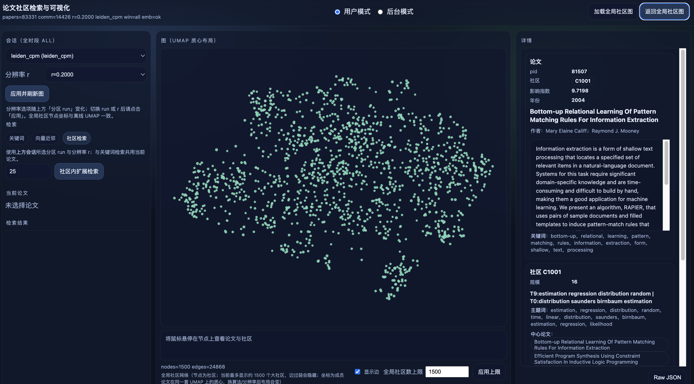
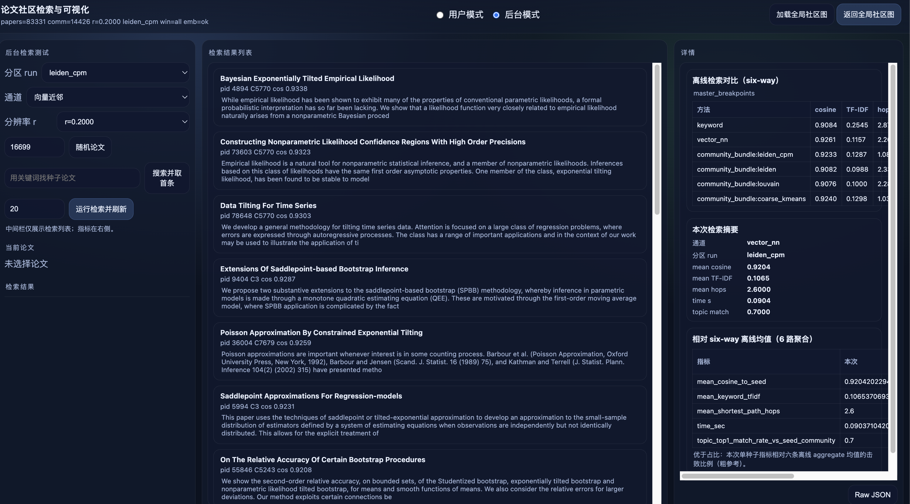
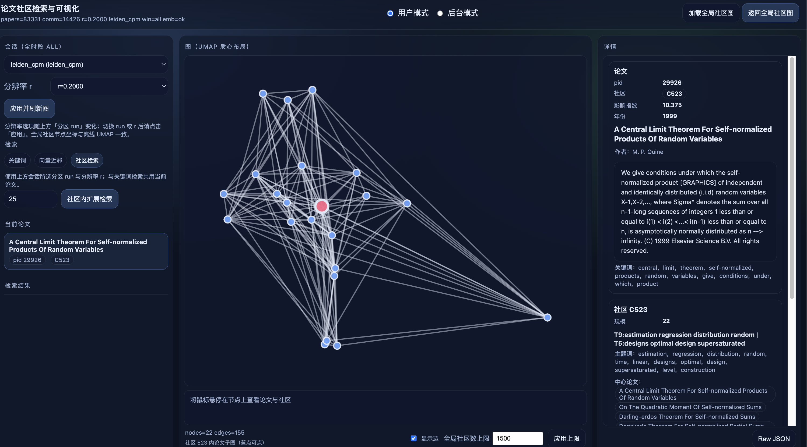
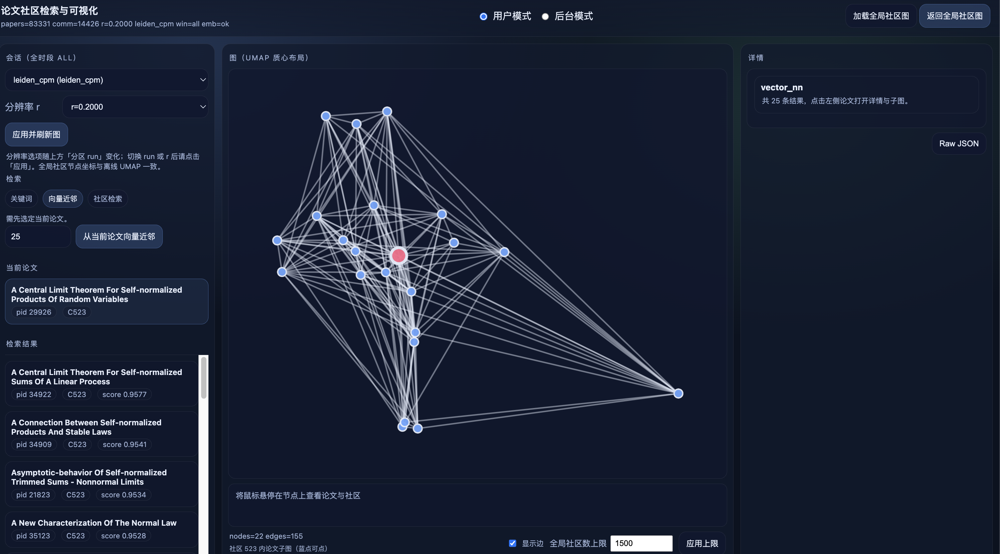
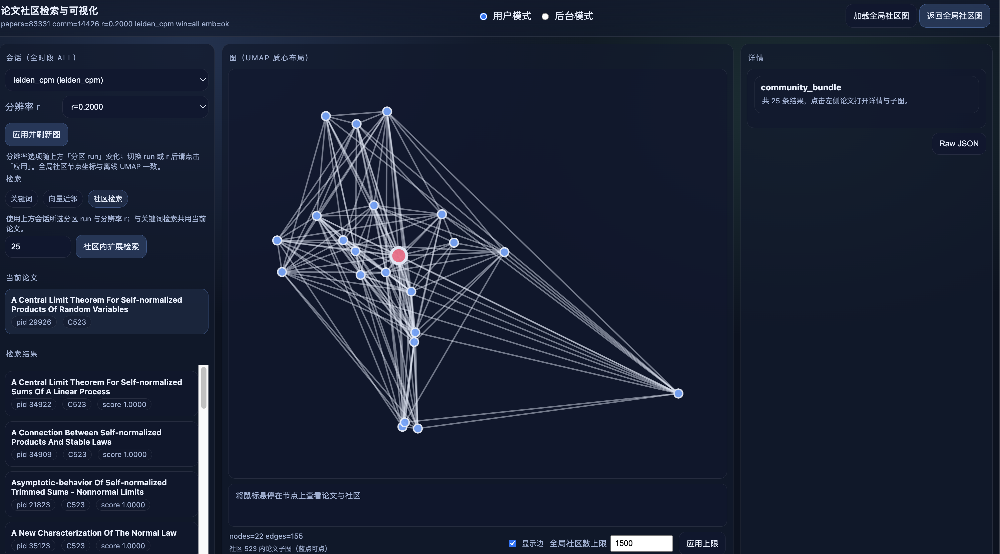

# 论文社区 Web 演示 — 用户手册

仓库 **三本核心说明** 之一（面向终端用户）：界面布局、两种模式、检索与图、Eval 等。**启动与依赖目录**见 **`developer_manual_zh.md`** §7 与下文「环境与启动」。**离线产物路径**见 **`offline-outputs-catalog.md`**。

---

## 1. 布局与模式

### 1.1 左 — 中 — 右三栏

- **左侧**：会话与检索控制（用户模式）或后台测试控制（后台模式）；「当前论文」固定区；「检索结果」列表。  
- **中间**：Cytoscape 图 + 图下方说明与控件（显示边、全局社区数上限等）。  
- **右侧**：详情面板（论文 + 社区卡片、后台指标表等）；可展开 **Raw JSON**。



### 1.2 用户模式 / 后台模式

顶部单选：**用户模式** | **后台模式**。

- **用户模式**：以「选论文 → 看社区子图 → 看详情」为主线的探索式使用。  
- **后台模式**：用与离线评测一致的三类检索通道做单种子实时测试，并与离线 **six-way** 表对比；中间栏为检索结果列表，右侧为指标。

切换模式会切换左/中栏可见区域；后台模式进入时会拉取离线 six-way 摘要表（若存在）。





---

## 2. 时间与分区范围

- Web 会话侧已固定为 **全时段 `all`**：左侧文案为「会话（全时段 all）」；算法 / 分区下拉中仅展示 **`time_window === "all"`** 的 manifest（与「不再单独选时间窗」的产品设定一致）。  

---

## 3. 用户模式详解

### 3.1 左侧：分区会话

1. **分区 run**：选择一种已登记的社区算法产物（如 `leiden_cpm`、`leiden`、`louvain`、`coarse_kmeans` 等）。  
2. **分辨率 r**：下拉列表来自当前 run 目录下的 **`summary.npy`**，若磁盘上 `membership_r*.npy` 更全，则以磁盘为准（与后端 `/api/v3/runs/{run_id}/resolutions` 一致）。  
3. **应用并刷新图**：将所选 **run + r** 写入服务端会话，并按当前参数重载图/健康信息。  
   - 切换 run 或 r 后，应点击 **应用**（或分辨率滑块在部分浏览器下 `change` 时已会推会话并刷新，以界面实际行为为准）。  
4. **加载全局社区图 / 返回全局社区图**：回到「以社区为节点」的全局视图（见 3.3）。

**先聚类（KMeans）子域**（仅当当前 run 为 **coarse_kmeans** 且存在 `/api/v2/domains` 数据时显示）：可选择 run 与 domain，**进入子域散点图** 在中间栏查看该域内论文的 UMAP 散点（论文节点，无社区聚合）。

### 3.2 左侧：检索（三个页签）

检索结果只写入下方 **「检索结果」**；**「当前论文」** 区仅随你点击某篇论文或当前焦点更新，不会被一次关键词检索整表替换。

| 页签 | 条件 | 行为 |
|------|------|------|
| **关键词** | 无 | `GET /api/search/keyword`，按 TF‑IDF 命中论文列表。 |
| **向量近邻** | 需已有 **当前论文** | `GET /api/search/vector_nn`，在 Specter2 嵌入空间做近邻。 |
| **社区检索** | 需已有 **当前论文** | `GET /api/search/community_bundle`，使用 **上方会话** 的 `run_id` + `resolution`，从种子论文在 mutual‑kNN 图上扩展邻居，优先同社区。 |

说明：**社区检索**在界面中为 **bundle 单通道**（与离线评测里的 `community_bundle:<run_id>` 对应）。离线对比中的多路 community 变体不在此分四个按钮暴露；若需完全对齐离线六路表格，请使用后台模式或离线 `comparison_runs`。





### 3.3 中间栏：图与交互

- **尚未选定当前论文**：默认展示 **全局社区图**（节点 = 社区，位置 = 成员论文在 **离线 UMAP** 上的质心；边 = 跨社区 kNN 边权聚合）。  
  - **全局社区数上限**：数字框 + **应用上限**（可保存到浏览器 `localStorage`）；过大可能卡顿。  
  - **显示边**：边在缩放较小时会自动隐藏以减少视觉噪声。  
  - 当 r 很大、社区极碎时，界面可能提示「单点分区」类说明；此时总图语义弱，建议将 r 调小。  
- **已选定当前论文**：进入该论文所在 **社区子图**（论文为节点；**红点** = 当前论文，**蓝点** = 同社区其他论文，默认 **不显示节点 label**，可点击跳转）。  
  - 子图尽量展示 **社区内全部成员**（上限由后端 `max_nodes` 控制，前端当前常量较大）；**边数**有上限（后端截断），避免边过密。  
  - 中间栏底部 **悬停提示**：鼠标停在节点上可看到 pid、标题片段、年份、社区等。

### 3.4 右侧：详情

选择论文后，右侧为 **`user_panel`**：

- **论文卡片**：标题、摘要、作者名列表、**社区**（可点进子图）、**影响因子**字段（当前与 **`structure_influence_index`** 相同，由图结构启发式计算，**非期刊 IF**）。  
- **社区卡片**：社区 id、**主题词 / 标签**（若已加载 `communities_topic_weights.csv`）、规模、**中心论文**、**桥接论文**、**相邻社区**（均可点击跳转）。同社区论文列表主要在左侧「检索结果」与中间子图体现，右侧不重复罗列所有成员。

---

## 4. 后台模式详解

### 4.1 左侧

- **分区 run**：与用户模式相同来源，但仅 **`all`** 窗。  
- **分辨率 r**：对 **四种基于图的社区算法 run**（Leiden CPM / Leiden RB / Louvain / coarse+kmeans）显示分辨率控件；与 manifest 内 `summary.npy` 一致。  
- **通道**（检索方式，共 **3** 类，不是 6 个独立「算法」按钮）：  
  1. **关键词（标题+摘要）**  
  2. **向量近邻**  
  3. **社区 bundle**（使用下方所选 **分区 run** + **分辨率**）  
- **种子论文**：手动 pid、**随机论文**、或关键词 **搜索并取首条**。  
- **运行检索并刷新**：调用 `GET /api/v3/retrieval/live`，在中间栏渲染命中列表（标题、摘要片段、pid、社区、与种子余弦等）。

### 4.2 中间栏

检索结果以 **卡片列表** 展示；点击卡片会调用与用户模式相同的 **选论文** 逻辑（便于跳到详情），但主流程仍以右侧指标为准。

### 4.3 右侧

1. **离线 six-way 表**（若 `out/experiment_eval/` 下存在对应 JSON/聚合数据）：展示各 **方法** 在 cosine / TF‑IDF / hops / time / topic 等列上的离线汇总（具体列以后端数据为准）。  
2. **本次检索摘要**：当前通道、分区 run、以及 **mean cosine / mean TF‑IDF / mean hops / time / topic match** 等 **绝对值**。  
3. **相对 six-way 离线均值**：将本次摘要与离线 **六路** aggregate 对比，给出 **z**、**优于占比** 等（粗参考，定义见界面脚注）。

### 4.4 返回全局图

顶部 **「返回全局社区图」** 与 **「加载全局社区图」** 在用户模式下同样可用；会按当前会话的 run+r 重新拉取全局社区图。

---

## 5. 操作原则（与实现一致）

1. **参数变更后要看到最新结果**：切换 **分区 run**、**分辨率**、或后台 **通道 / 种子** 后，请按 **「应用并刷新图」** 或 **「运行检索并刷新」** 等按钮触发请求（部分控件在变更时会自动推会话，以实际为准）。  
2. **顶栏状态**：展示论文数、社区数、当前 r、active run、embedding 是否加载；鼠标悬停可看 **主题表路径** 与是否已挂到社区等提示。  
3. **主题信息**：依赖 `out/topic_runs/<sweep>/K*/r*/communities_topic_weights.csv` 等离线产物；无表或社区 id 不匹配时，社区卡片中主题相关字段可能为空。

---

## 6. 环境与启动（摘要）

```bash
cd /path/to/paper-community
PYTHONPATH=src .venv/bin/python src/core.py demo-api \
  --resolution 0.2 \
  --host 127.0.0.1 --port 8000
```

默认读取 `out/experiments/**/manifest.json` 登记的 `leiden_dir`、`graph_npz`、`keyword_index` 等；可选环境变量 **`PC_TOPIC_COMMUNITIES_CSV`** 指定单一主题表覆盖。浏览器访问 **`http://127.0.0.1:8000/`**，API 文档 **`/docs`**。

更完整的依赖目录、显式 `--leiden-dir` / `--graph-npz` 启动示例见 **`developer_manual_zh.md`** §7。
